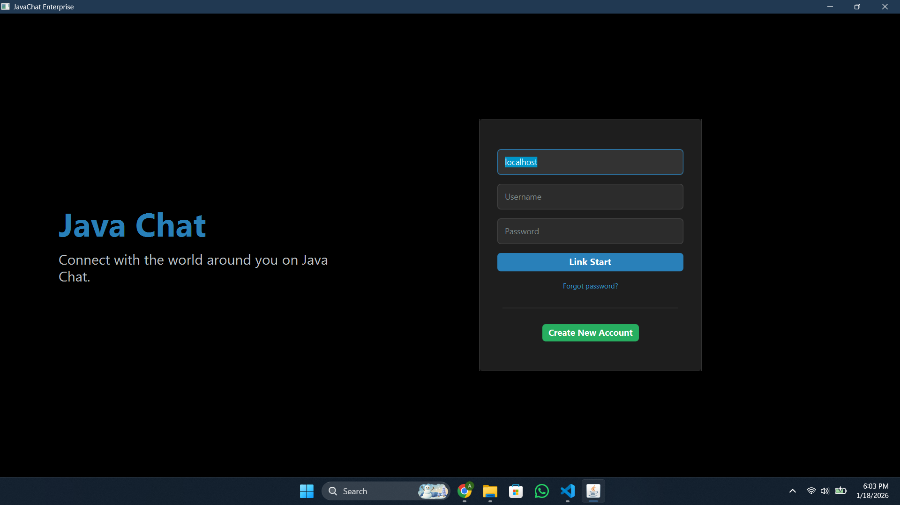
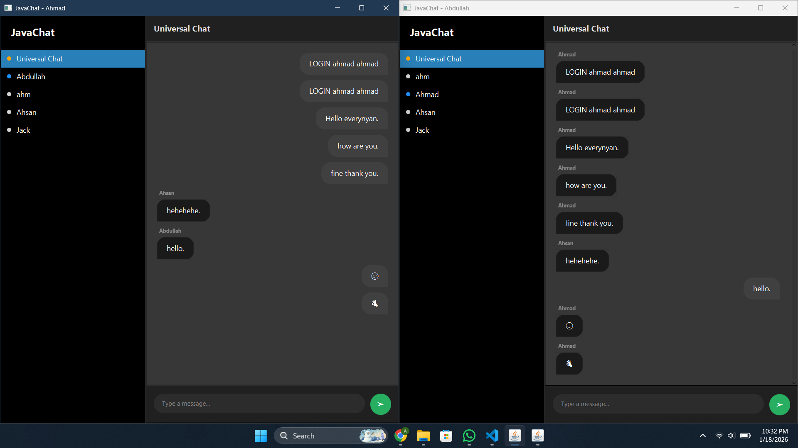

# Java Chat: Multithreaded Chat Application

A real-time chat application built from scratch using Java Sockets, Swing/JavaFX, and MySQL. It supports private messaging, persistent chat history, and secure email verification (OTP).

🚀 Key Features:

Real-time Communication: TCP Socket programming with multithreaded client handling.

Security: User authentication with OTP Email Verification (JavaMail API).

Persistence: MySQL database stores users and chat history.

Smart UI: Dynamic interface that handles login, registration, and live chat.

🛠️ Tech Stack: Java, MySQL, JDBC, Java Sockets, JavaMail.

